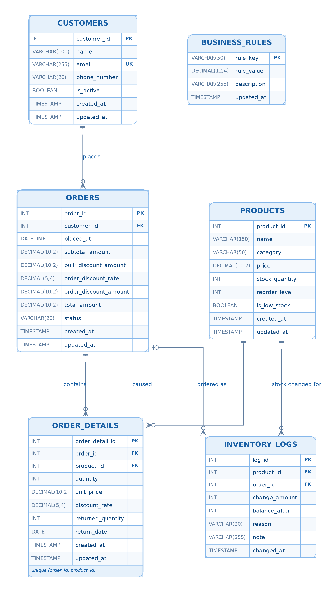
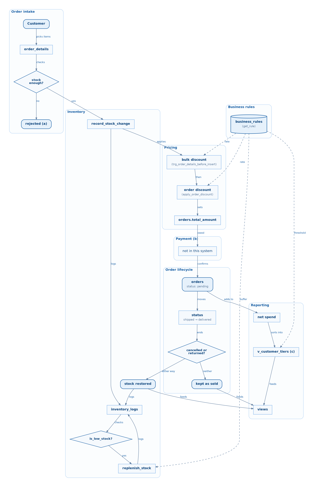
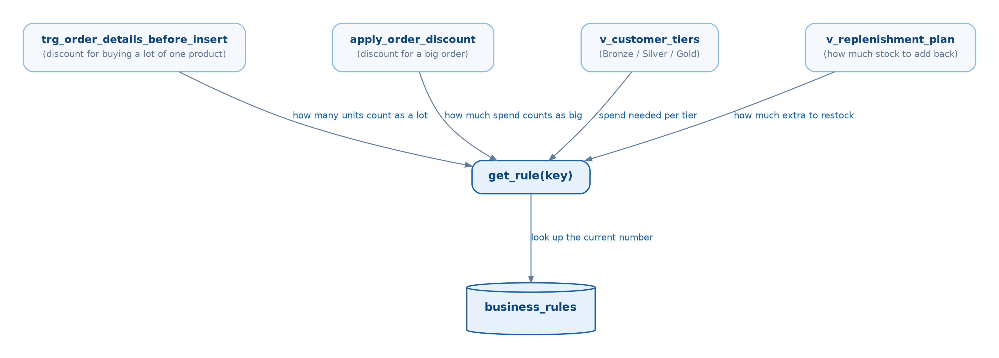

# Architecture

## Entity relationships

Regenerate this image whenever [02_tables.sql](../sql/schema/02_tables.sql)
changes — an ERD only stays trustworthy if it's rebuilt on every schema
change, not left to go stale.

Six tables, not five — `business_rules` is easy to forget because it has no
foreign key to or from anything else, so it never appears with a connecting
line above. It's read exclusively through `get_rule(key)`
([procedures.sql:7](../sql/procedures/procedures.sql#L7)), which every
discount, tier and replenishment calculation calls by key at the moment it
runs — a data dependency, not a schema one, which is exactly why an ERD
(which only draws foreign keys) can't show it as connected even though
almost everything in the system reads from it.

`orders` and `order_details` hold the order itself; `inventory_logs` is the
append-only audit trail for every stock change, whether it came from an
order, a return, a cancellation, a replenishment or a manual adjustment;
`business_rules` holds the tunable numbers (tier thresholds, discount bands)
so changing one is a single `UPDATE`, not a code change.

## What the system does, end to end

The diagram below is the plain-language version — what actually happens
from a customer's point of view, grouped by system part, using the real
table/procedure names (that way you can grep for them). Edge labels are
kept to a word or two on purpose; anything that needs more explaining is a
lettered note beside the diagram instead of crammed into the arrow.

Notes referenced by letter above, kept off to the side rather than in the
boxes:

- **(a)** — the whole order rolls back, not just the one short item;
  `place_order` runs as a single transaction ([procedures.sql:173](../sql/procedures/procedures.sql#L173)).
- **(b)** — no `payments` table exists anywhere in this schema. `total_amount`
  is the amount that *should* be charged; collecting it is a separate
  system this project doesn't model.
- **(c)** — computed live on every read, not stored on `customers`; see
  "Business rules" section above for why a stored tier column would go
  stale on its own.

## How the pieces fit together

### Build order

[run_all.sql](../sql/run_all.sql) sources the files in this order, and the
order matters — each step depends on the one before it:

| # | File | Creates |
|---|------|---------|
| 1 | `schema/00_drop_all.sql` | drops everything, so the build is repeatable |
| 2 | `schema/02_tables.sql` | `customers`, `products`, `orders`, `order_details`, `inventory_logs` — no logic, just structure |
| 3 | `schema/03_business_rules.sql` | `business_rules` — the tier thresholds and discount bands, as data |
| 4 | `procedures/procedures.sql` | `get_rule`, `record_stock_change`, `apply_order_discount`, `recalc_order_money`, `place_order`, `cancel_order`, `return_order_line`, `replenish_stock`, `adjust_stock`, `replenish_all` |
| 5 | `triggers/triggers.sql` | the 8 `trg_*` triggers on `order_details`, `orders`, `inventory_logs` |
| 6 | `views/views.sql` | `v_order_summary`, `v_low_stock`, `v_customer_tiers`, `v_order_discounts`, `v_stock_reconciliation`, `v_order_line_detail`, `v_replenishment_plan` |
| 7 | `indexes/01_indexes.sql` | indexes on the columns the views and procedures actually filter/join on |
| 8 | `seed/01_sample_data.sql` | sample rows, inserted through the procedures above, not raw `INSERT`s |

Procedures come before triggers because triggers call them (e.g.
`trg_order_details_after_insert` calls `recalc_order_money`) — MySQL would
error creating a trigger that calls a procedure that doesn't exist yet.

## Business rules: tunable numbers as data

Every threshold that could plausibly change — discount bands, tier cutoffs,
the replenishment buffer — lives as a row in `business_rules`
([03_business_rules.sql](../sql/schema/03_business_rules.sql)) instead of
being hardcoded into a procedure or view. Nothing reads the table directly;
everything goes through one function, `get_rule(key)`
([procedures.sql:7](../sql/procedures/procedures.sql#L7)), which looks up a
key and returns its `rule_value` — or raises an error on an unknown key, so a
typo fails loudly instead of silently returning `NULL`. Four consumers call
it, each for a different business decision:

Because every consumer resolves the same key through the same function, a
number only exists once: raising `bulk_t1_rate` from 5% to 7% is a single
`UPDATE business_rules SET rule_value = 0.07 WHERE rule_key = 'bulk_t1_rate';`
and every future order, tier calculation and replenishment plan picks it up
immediately — no procedure body, trigger or view definition changes.

One asymmetry worth noting: the read side has a single gateway (`get_rule`),
but there's no equivalent write-side procedure — changing a value is a raw
`UPDATE` against `business_rules`, unguarded by anything beyond the table's
own shape. That's an acceptable gap for numbers only an admin touches, but
it's not enforced the way stock changes are (every stock write is forced
through `record_stock_change`; no such gate exists here).